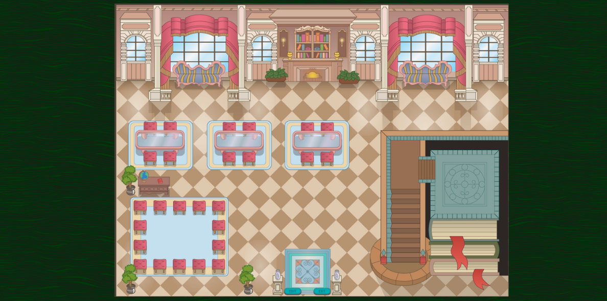

# 100 Roads Design

100 Roads has been designing and innovating in the education space since 2016. Our founder, Catherine Fraise, first designed a physical campus at Workspace Education in Bethel CT.

When lockdowns raised new problems, Catherine moved into developing online learning environments.

100 Roads Design is located in McLeod, Montana and our virtual campuses are created by a global team of digital architects, creatives, community builders and educators.

Learn more about us at https://100roadsdesign.com. 

## About the map

There are 28 virtual campuses in this repository.

Map name: Marketplace of Ideas.

Map name: Art Gallery.

Map name: Art-Studio.

Map name: Blue Sky Studios.

Map name: Blueberry Dorm.

Map name: Bookshop.

Map name: Cafe Delicieux.

Map name: Cherries.

Map name: Clouds Boutique.

Map name: Club House.

Map name: Cranberry Dorm.

Map name: E-commerse Building.

Map name: Educator Lounge.

Map name: Fitness Center.

Map name: Founders Building.

Map name: Historical Society.

Map name: Shed 1.

Map name: Movie Theater.

Map name: Noodles Cafe.

Map name: Research Center.

Map name: Skyloop.

Map name: Student e-commerce.

Map name: Study Hall A.

Map name: Study Hall B.

Map name: Tunnel.

Map name: Tutoring Center 1.

Map name: Tutoring Center 2.
## Copyright

This map is the sole property of 100 Roads Design LLC. All rights are reserved by 100 Roads Design LLC. All contents of the map may not be reproduced, distributed (for sale or otherwise), or create derivative works of the copyrighted work without the express written permission of 100 Roads Design LLC.